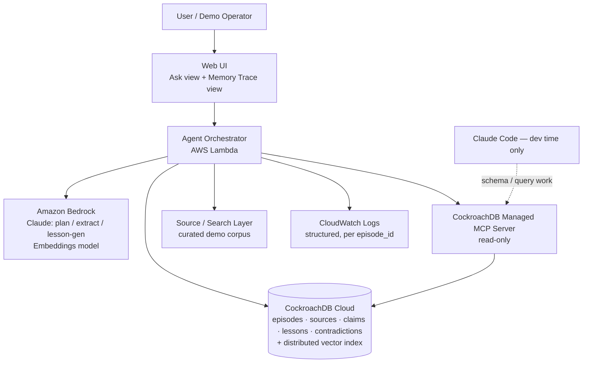
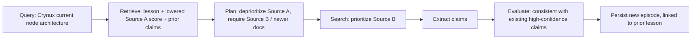
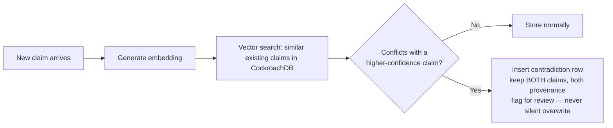
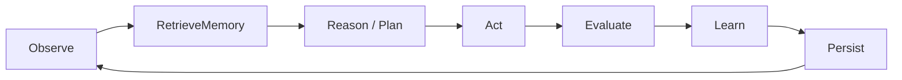

# Agent Black Box: Architecture

CockroachDB × AWS Hackathon: Build with Agentic Memory


---

## A. Executive Summary

Agent Black Box is a research agent for investigating Web3/AI infrastructure
projects (starting with Crynux and Neptune Privacy). Every time it researches something, it writes down what
happened; which sources it used, what it concluded, what went wrong... as a
structured "episode" in CockroachDB. Before it starts a *new* research task,
it looks back through that history: has it seen this topic before, has a
source it's about to use burned it before, has a similar strategy failed
before. That retrieved memory changes what it does next — which sources it
trusts, how much verification it demands.

The thing being proven, technically: retrieval isn't cosmetic. It has a
causal effect on the agent's next decision. That's the whole demo.

---

## B. Component Architecture

| Component | Responsibility |
|---|---|
| **Web UI** | Minimal two-view app: submit a research query, and a "Memory Trace" panel showing retrieve → plan → act → evaluate → learn → persist as it happens. This is the least technically ambitious piece and the most important for the demo — a judge has to *see* the causal chain, not take our word for it. |
| **Agent Orchestrator (AWS Lambda)** | Runs the decision loop. Stateless between invocations by design — all state lives in CockroachDB, which is itself the thing being demonstrated. |
| **Amazon Bedrock** | LLM calls for planning, claim extraction, and lesson generation; embeddings for semantic memory. |
| **CockroachDB Cloud** | System of record. Relational tables for episodes/sources/claims/lessons/contradictions, native `VECTOR` columns for embeddings, one database, one consistency model. |
| **CockroachDB Managed MCP Server** | Read-only, at runtime — the agent's actual memory-retrieval tool. Also used dev-time by Claude Code for schema/query work while building. |
| **Source/Search Layer** | A curated demo corpus (real Crynux/Neptune documents, including one deliberately superseded doc) plus a thin fetch wrapper. Scoped small on purpose — this is not the part of the system we're trying to impress anyone with. |
| **CloudWatch Logs** | Structured, per-stage logs correlated by `episode_id`. No custom observability stack. |


## C. Architecture Diagram



---

## D. Data Flows

### D1 — First research session (no relevant memory yet)

```mermaid
flowchart LR
    Q1[Query: Crynux node architecture] --> R1[Retrieve memory: nothing relevant]
    R1 --> P1[Plan: no prior signal, broad search]
    P1 --> S1[Search: Source A - older doc, Source B - official docs]
    S1 --> C1[Extract claims from A and B]
    C1 --> E1[Evaluate: A and B partially conflict]
    E1 --> L1[Lesson: Source A predates the multi-GPU/tensor-parallelism update]
    L1 --> W1[Persist episode + claims + lesson — one transaction]
    W1 --> Sc1[Update Source A reliability score down]
```



### D2 — Second session, same domain (memory changes behavior)




### D3 — Contradiction / memory governance (lightweight, by design)



### D4 — Agent decision loop



---

## E. Database Schema (initial — intentionally not over-designed)

```sql
CREATE TABLE sources (
  source_id         UUID PRIMARY KEY DEFAULT gen_random_uuid(),
  url               STRING,
  domain            STRING,
  source_type       STRING,       -- official_docs | blog | social | third_party
  project           STRING,       -- 'crynux' | 'neptune_privacy' | ...
  reliability_score FLOAT DEFAULT 0.5,
  times_used        INT DEFAULT 0,
  successful_uses   INT DEFAULT 0,
  problematic_uses  INT DEFAULT 0,
  last_evaluated    TIMESTAMPTZ,
  created_at        TIMESTAMPTZ DEFAULT now()
);

CREATE TABLE episodes (
  episode_id    UUID PRIMARY KEY DEFAULT gen_random_uuid(),
  project       STRING NOT NULL,          -- pre-filter key, see Section F
  query         STRING NOT NULL,
  strategy      STRING,
  status        STRING DEFAULT 'in_progress',  -- in_progress | completed | failed | pending_persist
  started_at    TIMESTAMPTZ DEFAULT now(),
  completed_at  TIMESTAMPTZ,
  final_answer  STRING,
  metadata      JSONB
);

CREATE TABLE episode_sources (
  episode_id  UUID REFERENCES episodes(episode_id),
  source_id   UUID REFERENCES sources(source_id),
  role        STRING,   -- used | rejected | deprioritized
  PRIMARY KEY (episode_id, source_id)
);

CREATE TABLE claims (
  claim_id       UUID PRIMARY KEY DEFAULT gen_random_uuid(),
  episode_id     UUID REFERENCES episodes(episode_id),
  source_id      UUID REFERENCES sources(source_id),
  project        STRING NOT NULL,
  text           STRING NOT NULL,
  embedding      VECTOR(1024),   -- confirm dimension against the Bedrock
                                  -- embedding model you actually pick at
                                  -- build time; don't hardcode this from memory
  confidence     FLOAT,
  superseded_by  UUID REFERENCES claims(claim_id),
  created_at     TIMESTAMPTZ DEFAULT now()
);

CREATE TABLE lessons (
  lesson_id   UUID PRIMARY KEY DEFAULT gen_random_uuid(),
  episode_id  UUID REFERENCES episodes(episode_id),
  source_id   UUID REFERENCES sources(source_id),  -- nullable: strategy lessons aren't source-specific
  project     STRING NOT NULL,
  text        STRING NOT NULL,
  embedding   VECTOR(1024),
  confidence  FLOAT,
  created_at  TIMESTAMPTZ DEFAULT now()
);

CREATE TABLE contradictions (
  contradiction_id     UUID PRIMARY KEY DEFAULT gen_random_uuid(),
  claim_id             UUID REFERENCES claims(claim_id),
  conflicting_claim_id UUID REFERENCES claims(claim_id),
  detected_at          TIMESTAMPTZ DEFAULT now(),
  resolved             BOOL DEFAULT false,
  resolution_note      STRING
);

-- Indexes: a plain btree on (project, started_at) for episodes and
-- (project, domain) for sources handles the pre-filter step below.
-- Vector indexes on claims.embedding and lessons.embedding — check current
-- CockroachDB docs for exact CREATE INDEX ... USING syntax at build time;
-- this is an actively-evolving feature area and worth confirming fresh
-- rather than trusting a remembered syntax.
```

No graph structure, no separate embeddings table, no denormalized
source-history-per-claim. Six tables total.

---

## F. Memory Architecture

- **Episodic memory** — `episodes`: a full record of one research task.
- **Semantic memory** — `claims.embedding` / `lessons.embedding`, queried via
  CockroachDB's distributed vector index.
- **Source reliability memory** — a running score on `sources`, not a
  learned model: `reliability_score = successful_uses / GREATEST(times_used, 1)`,
  with a mild recency weight (e.g., halve the weight of uses older than 30
  days) computed at read time or in a lightweight periodic job — not on the
  hot path.
- **Retrieval strategy** — this is the part worth being explicit about,
  because it's the actual answer to "why put vectors and transactional data
  in the same database instead of a dedicated vector store": retrieval is a
  **single query** that filters structurally first (`WHERE project = $1`)
  and *then* ranks semantically (`ORDER BY embedding <-> $2 LIMIT 5`). One
  round trip, one consistency guarantee, no risk of the vector store and the
  relational store drifting out of sync because they're not two systems.
- **Update strategy** — new episodes are appended, never edited. Claims are
  never overwritten, a corrected claim points at the old one via
  `superseded_by`, both remain queryable. This is what makes the
  contradiction mechanism (D3) meaningful instead of decorative.

---

## G. Agent Architecture (decision loop)

```
observe (new query)
  → retrieve memory   (SQL filter by project + vector search, single query)
  → reason / plan      (Bedrock call, given retrieved context — this is where
                         "Source A was previously flagged" actually changes
                         the plan, not just gets mentioned in a prompt)
  → act                 (fetch/search sources per the plan)
  → evaluate            (extract claims, run contradiction check against
                         existing high-confidence claims)
  → learn                (generate a lesson only when something informative
                         happened — a source underperformed, a strategy
                         failed — not a lesson every single time)
  → persist              (episode + claims + lesson in one transaction;
                         see Section J for what happens if this fails)
```

---


## I. CockroachDB Tools — the smallest combination with real credibility

**Distributed Vector Indexing** — core, non-negotiable. Powers claim/lesson
retrieval in Section F.

**Managed MCP Server** — used two ways:
1. **Dev-time**: Claude Code uses it while building; schema inspection,
   query iteration. Convenient, but not a demo feature.
2. **Runtime**: the agent's own retrieval step calls the MCP server,
   configured **read-only**, to pull memory during the plan stage. This is
   the one that counts; it's a live dependency of the agent's actual
   reasoning, not a dev convenience dressed up as a feature.

**ccloud CLI** — used once, to provision the cluster. Not part of the
running system. Disclosed honestly as operational tooling, not counted
toward "meaningful integration" 

**Agent Skills Repo** — referenced in the README as a dev-time aid for
schema/query best practices. Not a runtime component.

---

## J. Security

- **Secrets**: AWS Secrets Manager for the CockroachDB connection string;
  Bedrock access via the Lambda execution role's IAM permissions, not static
  keys. `.env.example` only in the repo — nothing live committed.
- **Least privilege / service accounts**: two distinct credentials —
  (1) the application backend's SQL role, read/write, scoped to the six
  tables above; (2) the agent-facing MCP session, **read-only**, used only
  for retrieval. The agent never holds a credential capable of writing to or
  altering the database. All writes go through the application's own
  parameterized query code, never through agent-generated SQL.
- **MCP security**: read-only mode is CockroachDB's own default for the
  Managed MCP Server — we're relying on that default for the runtime
  connection rather than reconfiguring it more permissively.
- **Auth**: none for MVP.

---

## K. Reliability & Failure Handling

- **LLM failures**: retry with backoff (2 attempts), then mark the episode
  `failed`. Never fabricate an answer to avoid an empty result.
- **Source fetch failures**: skip and log; if zero sources succeed, the
  episode is `failed`, not `completed`.
- **Persistence**: episode + its claims commit in a **single CockroachDB
  transaction**. Since CockroachDB is serializable by default, the app needs
  a client-side retry loop on serialization-failure errors — a real,
  non-decorative detail worth having in the code, not just this doc.
- **The stated principle** — *"a research answer isn't complete if its
  memory can't be safely persisted"* — is enforced **synchronously** for the
  episode-critical write (episode + claims). It's enforced
  **asynchronously** for the derived reliability-score recompute, since
  that's a rolling aggregate, not a source of truth, and blocking the
  critical path on it buys nothing.
- **Idempotency**: client-generated `episode_id` (UUID), safe to retry the
  same insert without creating duplicates.
- **Duplicate memories**: a cheap embedding-similarity check against claims
  already recorded in the *same* episode before insert — not a dedup
  pipeline, just a sanity check.

---

## L. Observability

- Structured JSON logs per loop stage (retrieve / plan / act / evaluate /
  learn / persist), all tagged with `episode_id`, shipped to CloudWatch via
  Lambda's default logging — no custom stack.
- A handful of demo-relevant metrics (episodes/day, contradictions
  detected, average reliability-score delta) can just be SQL queries against
  CockroachDB itself — genuinely a nice minor talking point ("the
  observability layer is the system of record") rather than standing up
  Grafana for a 10-day solo project.

---